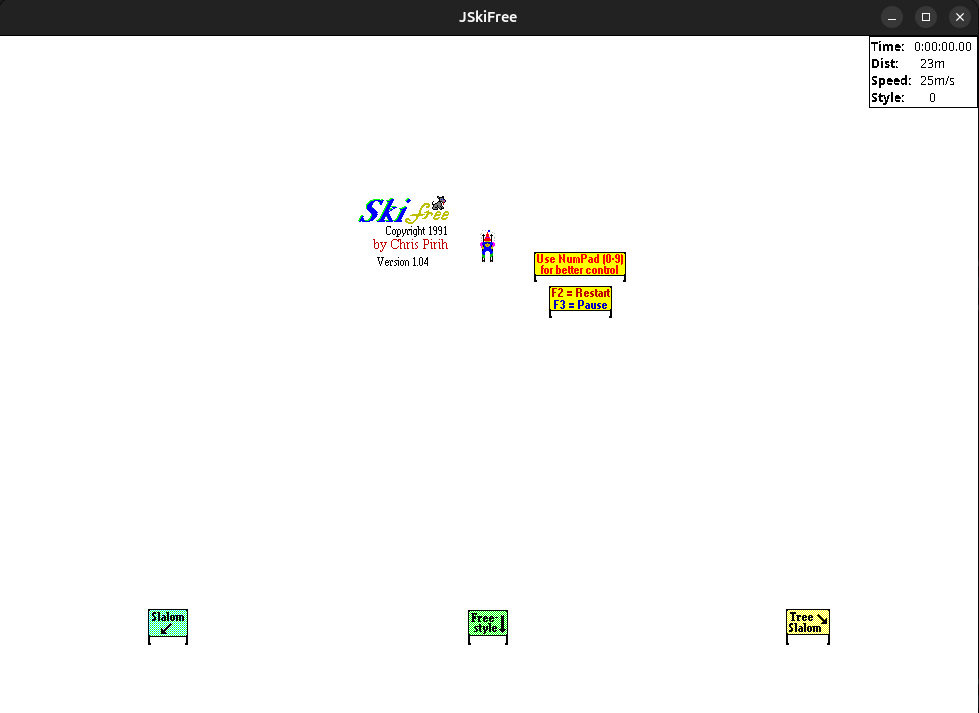

# JSkiFree



A from-scratch re-implementation of `ski32.exe`, Chris Pirih's SkiFree 1.04,
a 1991 Win32 GDI game, written in Java. It needs nothing but a JDK (17 or
newer; built and tested on 25): the window is Swing/Java2D and the sound is
`javax.sound.sampled`, so it runs anywhere Java does.

```
make                          # builds bin/ and skifree.jar
make run                      # silent, the default
make sound                    # with the yeti's cry and its eating noise
java -jar skifree.jar sound   # the same, by hand
```

Sound is off unless you ask for it; `java -jar skifree.jar --help` lists
everything.

## Controls

These are the original's, including the numeric-keypad scheme the game's own
help sign tells you to use.

| Key | Action |
| --- | --- |
| numpad `4` / `6`, Left / Right | turn; press again at full lock to skate for speed |
| numpad `2`, Down | point straight down the fall line |
| numpad `1` `3` `7` `9`, Home / End / PgUp / PgDn | snap to a fixed heading |
| numpad `8`, Up | herringbone back up the hill; in the air, change trick |
| numpad `0`, Insert (and Space, an addition) | jump |
| `F3` | pause |
| `F2`, or Enter / click once eaten | restart (the original shows no prompt after the yeti; it just waits) |
| `Escape` | minimise (what the original did) |
| `q` | quit (an addition; the original had only the window's close box) |

Moving the pointer steers: on the snow the skier turns towards wherever the
pointer sits relative to him, and in the air the pointer's quadrant picks the
trick. Either button jumps, and the click jump is stronger than the
keyboard's and costs no downhill speed, so the original quietly rewarded
mouse players.

There is also a set of undocumented character keys, taken from the
original's `WM_CHAR` handler. They are case-sensitive, because `WM_CHAR`
delivers characters rather than key codes:

| Key | Effect |
| --- | --- |
| `f` | toggle double speed, a **toggle**, lowercase only, and it speeds up the whole hill, not just you |
| `x` / `X` | nudge the skier two units right / left |
| `y` / `Y` | nudge two units down / up |
| `r` | repaint the hill (a debugging aid the original shipped with) |
| `t` | run one extra game frame right now (likewise) |

The speed toggle resets when you restart.

While you are in the air, Up and Down cycle through the tricks, spread
eagle, flip, tuck, and each is worth more style per frame than the last.
Only the spread eagle and the two side jumps land cleanly; come down in any
other pose and you wipe out. The crash is the whole punishment, though, it
costs no style, and neither does skating. Two branches in the original say
otherwise, but both are unreachable, and `Skier.java` explains why so nobody
helpfully re-adds them.

Ski down the marked corridor past a **Start** banner to begin one of the
three runs. Slalom and Tree Slalom are timed, with a five-second penalty for
each gate you take on the wrong side; Freestyle is scored on style. Finish a
run and its top-ten table appears in a message box over the hill, drawn to
match the original's "High Scores" dialog, grey panel, centred lines, an
OK button. It is modal, as the original's was: the hill freezes and the
skier stands still, uncontrollable, until you press something to dismiss
it. A copy is printed to the terminal. The window opens as the original did,
a square as tall as the screen, and refuses to shrink below 320x300. Like the
original it runs only while its window is active, it starts paused until it
is focused, stops when focus leaves, and F3 pauses on top of that, and its
status readout ticks over every 328 ms rather than every frame.

Get to 2000 m and something else turns up.

High scores live in `~/.skifree`, in the same shape as the `[Ski]` section
the original wrote into `entpack.ini`: keys `SS`, `GS` and `FS`, each a
space-separated top-ten list, with times stored negated so a single
descending sort ranks both times and style scores.

## Sound

The original author of SkiFree, Chris Pirih, mentions on [The Most Officialest SkiFree Home Page!](https://ski.ihoc.net/)
that in 1993 he started working on a Version 2 of the game that would include
sounds.

Another SkiFree-aficionado, foone, mentions on [his blog](https://foone.wordpress.com/2017/06/20/uncovering-the-sounds-of-skifree/) that the original binary
does in fact contain calls to missing sound files, which he was able to obtain
from Chris Pirih himself. Using these sound files he proceeded to creating a
SkiFree binary for windows containing these sounds. The binary can be downloaded
from the [Wayback Machine](https://web.archive.org/web/20230528034658if_/http://foone.org/downloads/skifree/ski32sounds.zip).

This port plays the sound files from foone's binary, just as the original
intended to do. Sound is **off by default**. Launch with
`java -jar skifree.jar sound` to enable it; `nosound` is also accepted and is
the same as the default.

## Layout

One Java class per module of the C original. Where the C build embedded the
sprites, sounds and icon as generated tables, this port decodes the extracted
originals at start-up instead, so there are no generator scripts.

```
src/skifree/Consts.java      types, constants, everything that was a #define
src/skifree/Tables.java      the numeric tables, each with the address it came from
src/skifree/GameObject.java  one sprite record on the hill
src/skifree/Game.java        the game state, the original's globals
src/skifree/Graphics.java    Java2D back end (the GDI mapping is documented at the top)
src/skifree/Sprites.java     decodes the 89 4bpp DIBs, white keyed out
src/skifree/Icon.java        decodes the window icon from the .ico
src/skifree/Resources.java   classpath loading and little-endian helpers
src/skifree/World.java       object list, terrain streaming, viewport, drawing
src/skifree/Motion.java      the physics step shared by everything that moves
src/skifree/Skier.java       the player's state machine and input
src/skifree/Npc.java         other skier, dog, snowboarder, fire, walking trees, yeti
src/skifree/Collide.java     collision rules
src/skifree/Course.java      the three runs, gates, timing
src/skifree/HighScore.java   ~/.skifree
src/skifree/Sound.java       single-voice playback of the WAV clips
src/skifree/JSkiFree.java    start-up, event loop, status bar
src/resources/               the extracted originals: sprites/ (89 BMPs + index.txt), sounds/, icons/
```

`src/resources/sprites/index.txt` lists the BMPs in resource-id order; if
the sprites are re-extracted, regenerate it with
`ls src/resources/sprites/*.bmp | xargs -n1 basename | sort > src/resources/sprites/index.txt`.

## Provenance

SkiFree is Chris Pirih's, and the artwork and sounds are his as well. This
re-implementation exists to honor the original game and allow those old
farts of us who have decided to leave the nostalgia of Windows behind to
continue enjoying it, now on anything with a JVM.
